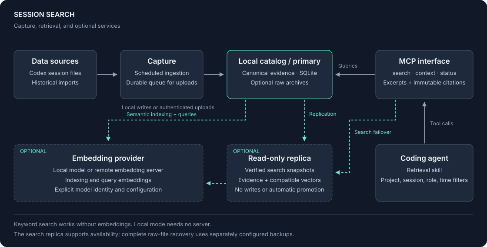

# Session Search

A personal project for searching previous Codex conversations through MCP.
It captures session history in the background and returns excerpts with citations
to the original conversation. I built it so my agent can refer to earlier work
across sessions.

The implementation uses Python and SQLite, with keyword search and optional
embeddings. Capture and keyword retrieval work independently of the embedding
model. Citations identify immutable revisions; filters scope results by project,
session, role, and time. It runs locally or as an authenticated shared service.

| Reference | Contents |
| --- | --- |
| [Architecture](docs/architecture-rendered.md) | Capture, storage, retrieval, and service boundaries |
| [Evaluation](docs/retrieval-evaluation.md) | Ranking experiments, results, and limitations |
| [Setup](docs/agent-install.md) | Installation and background capture, carried out by an agent |
| [Development](CONTRIBUTING.md) | Code layout and checks |

Development version · Python 3.11+ · Apache-2.0

[Implementation status](docs/implementation.md) · [Documentation](docs/README.md) · [Provenance](docs/provenance.md)
