# Architecture

Rendered companion to the [editable Mermaid source](architecture.md).

Session Search supports an isolated local installation or a shared service. These diagrams describe roles and data flow; deployment addresses and backup policy belong in operator configuration.

## 1. One agent interface, two modes

The agent uses three tools: `search`, `context`, and `status`. Configuration selects where the work happens.

These are alternative deployment modes. The isolated installation never uploads data or falls back to a remote model. Its model is provisioned explicitly; keyword search remains usable if the model is absent.

| Tool | What the agent receives |
| --- | --- |
| `search` | Ranked excerpts, immutable citations, and coverage or degradation details. |
| `context` | Bounded surrounding evidence for one or more citations, including the matched passage. |
| `status` | Service health, indexing lag, pending uploads, and durability state. |

The `session-search` CLI handles setup, capture, backup verification, and manual offload. Search output defaults to a 16 KiB total budget; context defaults to 32 KiB. Both cap at 64 KiB and report omissions.

## 2. One primary service, optional infrastructure

Clients use authenticated HTTPS. A private network such as Tailscale can provide
reachability; each client still needs its own application credential.

A single primary is sufficient. Clients retain pending uploads during an outage.
An optional read-only replica can serve searches, but never accepts uploads or
becomes a writer automatically. Without a replica, a primary outage is reported
as unavailable rather than as an empty result.

Embeddings can run locally or through an explicitly configured endpoint. Provider
failure falls back to keyword search. Changing deployment location does not require
reembedding when model identity and preprocessing remain compatible.

## 3. Capture first, add semantic search independently

Acknowledged history must survive a process restart. Embedding availability must never block durable capture or keyword indexing.

Capture stages complete JSONL records and retries partial tails later. With `--incremental`, persistent checkpoints reuse completed turns after verifying the full prior byte prefix and session ownership. A missing or incompatible checkpoint falls back to a full parse. Staging and prefix verification still read existing bytes; incremental parsing does not make total capture I/O constant. Upload retries preserve identity, and acknowledgement follows durable content and metadata commits.

Keyword coverage becomes available before semantic work completes. Background indexers share a per-catalog lock; interactive query embeddings bypass it and use a bounded provider timeout. A pilot sustained-contention check passed, but this does not control unrelated applications sharing the endpoint. Failed records remain visible and retryable without blocking later records. See [retrieval evaluation](retrieval-evaluation.md) for measurements and limits.

The primary updates its SQLite catalog transactionally. The standby activates verified immutable snapshots and pins generations for active readers. Keyword-only queries do not load vectors. Citations identify a session, revision, and event independently of a snapshot generation or a machine's file path.

## 4. Backups belong to the operator

Search availability and recoverability are separate. Operators choose their own
backup software, destination, retention, and restore procedure. Session Search
does not require a second computer, Restic, or a particular number of backup copies.

Back up a consistent SQLite catalog together with its referenced immutable objects.
Use an online SQLite backup or exclude writers during the copy; copying a changing
database file alone is insufficient. Include runtime configuration and separately
recoverable credentials if the service must be rebuilt on another machine.

Raw session archival is opt-in. A search replica is not a complete recovery backup.
Native session deletion is never automatic. The existing optional offload commands
use their own explicit restore-proof policy; ordinary search and capture do not
require that workflow, and an external backup is not silently treated as its proof.
See [backup ownership](backup-ownership.md) for the boundary.

## Design choices

| Choice | Reason |
| --- | --- |
| One primary; optional read-only replica | Keep the default deployment small; add availability only when needed. |
| SQLite FTS5 and immutable generations | Keep deployment small and make publication consistent. |
| Keyword search independent of embeddings | Keep fresh evidence searchable during model outages. |
| Raw archival opt-in; offload manual | Let each device control what leaves it and what is removed. |
| Same core, optional server | Support shared history and isolated local installations. |

See the [reliability contract](reliability.md) for the conditions these diagrams depend on.
