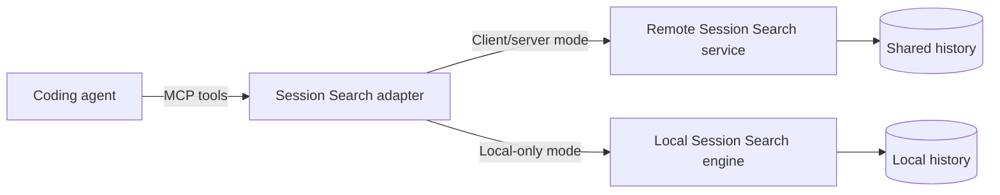
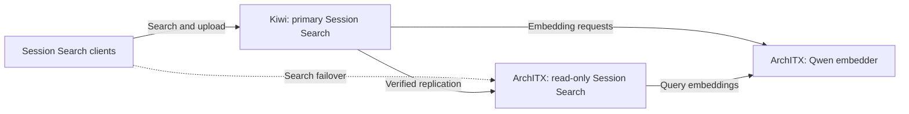
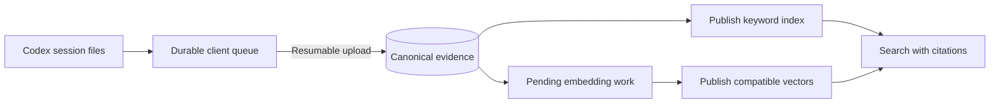
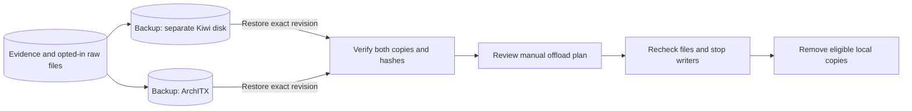

# Architecture

**Proposed design.** Diagrams describe intended behavior. Host names in the deployment example are replaceable; local mode requires no server.

## 1. One agent interface, two modes

The agent uses three tools: `search`, `context`, and `status`. Configuration selects where the work happens.

These are alternative deployment modes. The isolated installation never uploads data or falls back to a remote model. Its model is provisioned explicitly; keyword search remains usable if the model is absent.

| Tool | What the agent receives |
| --- | --- |
| `search` | Ranked excerpts, immutable citations, and coverage or degradation details. |
| `context` | Bounded surrounding evidence for one or more citations, including the matched passage. |
| `status` | Service health, indexing lag, pending uploads, and durability state. |

The `session-search` CLI handles setup, capture, backup verification, and manual offload. Search output defaults to a 16 KiB total budget; context defaults to 32 KiB. Both cap at 64 KiB and report omissions.

## 2. Personal deployment: one writer, a search standby

Clients connect through authenticated HTTPS over Tailscale. Joining the network provides reachability; each device also needs Session Search credentials.

Kiwi remains the only writer. Clients retain pending uploads while it is unavailable; the standby never accepts those writes. Search retries eligible connection failures, timeouts, and transient server errors against the standby. Authentication and invalid-request errors are returned directly.

ArchITX serves Qwen3-Embedding-0.6B-Q8 with 1,024-dimensional vectors. Kiwi's embedding worker is to be disabled; this does not require reembedding when model identity and preprocessing remain compatible. Plex changes and testing are outside Session Search's work.

Both search servers depend on the same embedder. Its failure therefore degrades both to keyword search; having two search servers does not provide embedding redundancy. When both search servers are unreachable, lightweight clients report search unavailable.

## 3. Capture first, add semantic search independently

Acknowledged history must survive a process restart. Embedding availability must never block durable capture or keyword indexing.

Capture reads complete JSONL records incrementally and retries partial tails later. Upload retries preserve identity rather than creating duplicate history. The server acknowledges only after content and metadata are durably committed.

Keyword coverage becomes available before semantic work completes. A bounded dispatcher reserves capacity for interactive queries and limits background work. Failed records remain visible and retryable without blocking later records.

The engine reuses immutable index generations, loads metadata lazily, and avoids loading vectors for keyword-only queries. Citations identify a session, revision, and event independently of an index generation or a machine's file path.

## 4. Reclaim local storage only after proving recovery

Search indexes are rebuildable. Canonical evidence and opted-in raw session files are retained separately. A search replica provides availability; backup snapshots provide recovery.

Offload retains at least 30 days locally, excludes active sessions, and requires indexed evidence plus exact raw-file recovery from both required backup destinations. Apply rechecks the reviewed plan, file identity, content hashes, and durability; changed or ambiguous files are skipped.

Removing a local copy never deletes shared history. Restoration uses an explicit destination and never overwrites an existing file. This recovers session evidence, not project files, attachments, credentials, or a complete Codex application installation.

## Design choices

| Choice | Reason |
| --- | --- |
| One writer; read-only standby | Avoid conflicting history while keeping search available. |
| SQLite FTS5 and immutable generations | Keep deployment small and make publication consistent. |
| Keyword search independent of embeddings | Keep fresh evidence searchable during model outages. |
| Raw archival opt-in; offload manual | Let each device control what leaves it and what is removed. |
| Same core, optional server | Support both shared personal history and an isolated work computer. |

See the [reliability contract](reliability.md) for the conditions these diagrams depend on.
